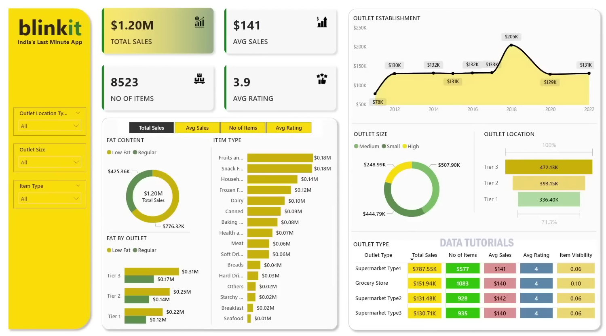

# Blinkit Sales Analysis

---

## Table of Contents
- [Project Overview](#project-overview)
- [Tech Stack](#tech-stack)
- [Dataset](#dataset)
- [Business Questions Addressed with SQL](#business-questions-addressed-with-sql)
- [Business Questions Explored in Python EDA](#business-questions-explored-in-python-eda)
- [Power BI Dashboard](#power-bi-dashboard)
- [Dashboard Screenshots](#dashboard-screenshots)
- [Key Insights](#key-insights)

---

## 🚀 Project Overview
This project performs a comprehensive **Blinkit Grocery Sales Analysis** (Blinkit - India's leading quick-commerce platform) using sales data from various outlets. The goal is to analyze sales performance, item visibility, customer ratings, outlet characteristics, and product attributes to derive actionable business insights.

The analysis covers revenue trends, item fat content impact, outlet type/size/location performance, establishment year trends, and customer rating patterns — all visualized through an interactive **Power BI dashboard**.

**Key Goals:**
- Understand total revenue and average sales across outlets
- Analyze performance by Item Fat Content (Low Fat vs Regular)
- Evaluate impact of outlet size, location tier, and outlet type
- Identify trends over establishment years
- Explore relationship between item visibility, ratings, and sales
- Provide stakeholder-ready insights for inventory, marketing, and expansion strategies

---

## 🛠 Tech Stack
- **Python** – Exploratory Data Analysis & Visualizations  
  Libraries: `pandas`, `numpy`, `matplotlib`, `seaborn`
- **SQL (MySQL)** – Data querying, cleaning, aggregation, and KPI calculation
- **Power BI** – Interactive dashboard creation and reporting
- **Excel** – Initial data validation and cross-verification

---

## 📊 Dataset
The dataset contains grocery sales records from Blinkit outlets with the following key columns:

- `Item_Identifier`, `Item_Weight`, `Item_Fat_Content` (Low Fat / Regular)
- `Item_Visibility`, `Item_Type` (e.g., Fruits and Vegetables, Snack Foods, Dairy)
- `Sales` (Item outlet sales in USD)
- `Rating` (Customer rating out of 5)
- `Outlet_Identifier`, `Outlet_Establishment_Year`
- `Outlet_Size` (Small, Medium, High)
- `Outlet_Location_Type` (Tier 1, Tier 2, Tier 3)
- `Outlet_Type` (Supermarket Type1, Type2, Type3, Grocery Store)

---

## 🔍 Business Questions Addressed with SQL

Click to expand SQL business questions

1. **Total Sales (Revenue)**  
   What is the total revenue generated across all outlets?

2. **Average Sales per Item**  
   What is the average sales amount per item?

3. **Total Number of Items Sold**  
   How many item transactions are recorded?

4. **Sales by Item Fat Content**  
   How do Low Fat and Regular items compare in total sales and average sales?

5. **Average Customer Rating Overall**  
   What is the overall average rating given by customers?

6. **Performance by Fat Content and Key Metrics**  
   Total sales, average sales, number of items, and average rating grouped by Item Fat Content.

7. **Recent Outlet Performance (Established in 2020)**  
   How do Low Fat vs Regular items perform in outlets established in 2020?

8. **Sales by Outlet Location Tier**  
   Which location tier (Tier 1, Tier 2, Tier 3) generates the highest sales?

9. **Outlet Type Performance Comparison**  
   How do different outlet types (Supermarket vs Grocery Store) perform in sales and ratings?

10. **Impact of Outlet Size on Sales**  
    Does outlet size (Small, Medium, High) influence total sales?

---

## 📈 Business Questions Explored in Python EDA

Click to expand Python EDA business questions

1. **Sales Distribution Across Years**  
   How have sales trended since the earliest outlet establishment?

2. **Top Performing Item Types**  
   Which item categories (e.g., Fruits, Snacks, Household) contribute most to revenue?

3. **Item Visibility vs Sales Correlation**  
   Is there a relationship between item visibility and sales performance?

4. **Outlet Size and Location Impact**  
   How do sales vary across outlet sizes and location tiers?

5. **Fat Content Preference Trends**  
   Do customers prefer Low Fat or Regular items in different outlet types?

6. **Rating vs Sales Analysis**  
   Do higher-rated items generate more sales?

7. **Outlet Type Efficiency**  
   Which outlet type (Supermarket Type1/2/3 vs Grocery) has better average sales and ratings?

8. **Year-wise Growth Pattern**  
   Identifying peak performance years and potential decline reasons.

---

## 📊 Power BI Dashboard

The interactive Power BI dashboard provides a complete overview of Blinkit sales performance with dynamic slicers for filtering by:

- Item Fat Content
- Outlet Size
- Outlet Location Type
- Outlet Type
- Item Type

**Key Features:**
- KPI Cards: Total Sales, Average Sales, Total Items, Average Rating
- Sales trend by Outlet Establishment Year
- Breakdown by Fat Content, Item Type, Outlet Tier, and Size
- Comparative analysis across outlet types
- Visuals: Donut charts, bar charts, line charts, and tables

---

## 🖼️ Dashboard Screenshots

**Blinkit Sales Dashboard Overview**

  

## 🔑 Key Insights
- Total sales reached **$1.20 Million** with an average of **$141 per item**
- **Low Fat** items contribute **~$776K**, significantly higher than Regular (~$425K)
- **Tier 3** locations generate the highest sales, followed by Tier 2 and Tier 1
- **Supermarket Type1** outlets dominate both in sales volume and count
- Sales peaked around 2018–2020 but show a decline post-2020
- Higher item visibility does not always correlate strongly with higher sales
- Customer rating averages **3.9**, consistent across most outlet types
- Fruits & Vegetables and Snack Foods are top revenue-generating categories

---

⭐ **If you find this project useful, feel free to star the repository!**